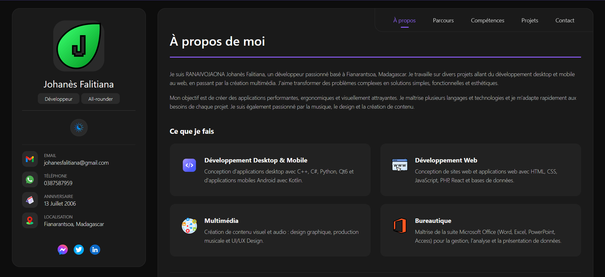
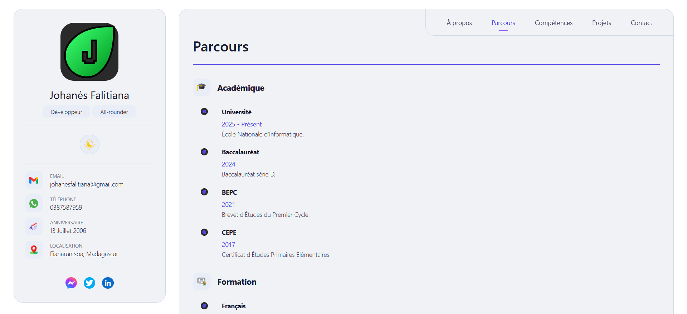
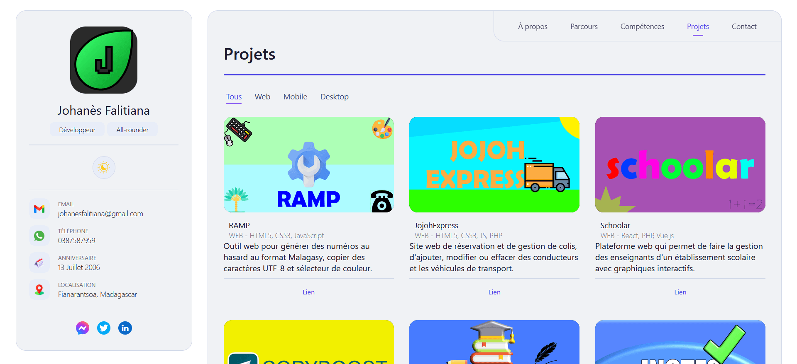
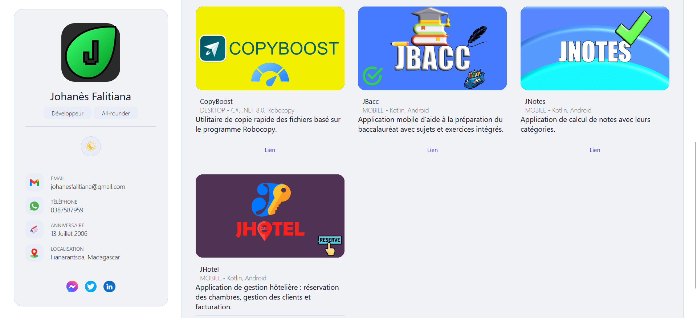
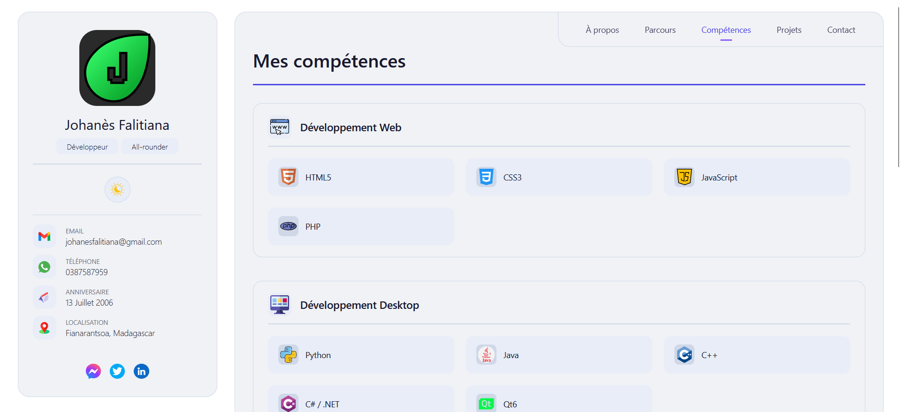
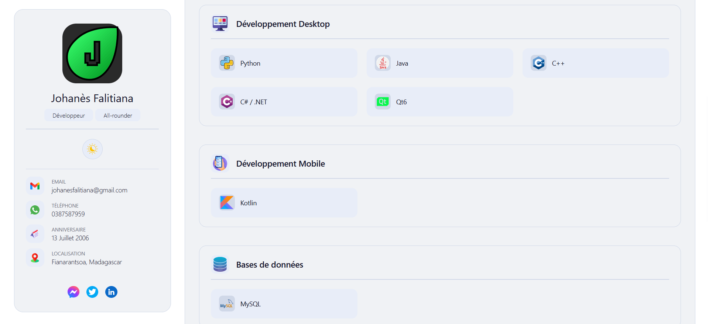
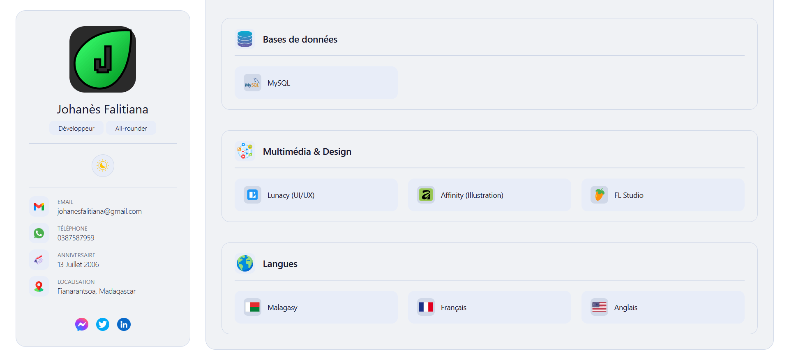
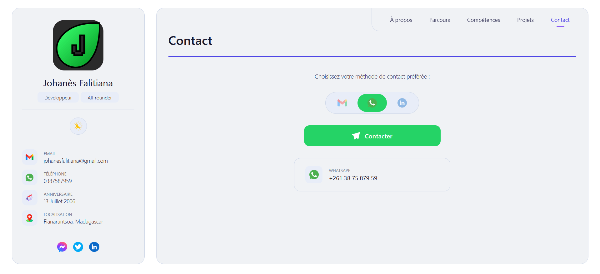

# 🍀 Johanès Falitiana

## **Développeur Junior** • **Étudiant en Informatique**

**Portfolio :** [https://johanes-mg.github.io/Johanes](https://johanes-mg.github.io/Johanes)

---

## 🍀 À propos de moi

Je suis RANAIVOJAONA Falitiana Johanès, un étudiant en 2ème année **d'Informatique Général** à **l'Ecole Nationale d'Informatique de Fianarantsoa**, passionné par le développement d'applications Web, Mobile et Desktop et l'exploration des pratiques de développement modernes.

_"🎨Colorons le monde au-delà des lignes"_

---

## 🎖️ Compétences

| Catégorie       | Compétences                                           |
| --------------- | ----------------------------------------------------- |
| **Langues**     | Malagasy, Français, Anglais                           |
| **Langages**    | Python, HTML5, CSS3, JavaScript, PHP, Kotlin, C++, C# |
| **Frameworks**  | React, Qt6, .NET 8.0                                  |
| **Graphiques**  | Lunacy UI/UX, Canva, Affinity Designer                |
| **Bureautique** | Suites Office (Word, Excel, PowerPoint, Access)       |

---

## 🛠️ Tech Stack

**Langages**

**Frameworks & Bibliothèques**

**Outils**

---

## 📱 Projets réalisés

| Projet           | Plateformes        | Technologies utilisées  |
| ---------------- | ------------------ | ----------------------- |
| **RAMP**         | Web                | HTML5, CSS3, JavaScript |
| **Marv**         | Web                | HTML5, CSS3, JavaScript |
| **JojohExpress** | Web                | HTML5, CSS3, JS, PHP    |
| **Schoolar**     | Web                | React, PHP, Chart.js    |
| **JojohExpress** | Web                | C#, .NET 8.0, Robocopy  |
| **CopyBoost**    | Desktop/Windows    | C#, .NET 8.0, Robocopy  |
| **JBacc**        | Application mobile | Kotlin, Android         |
| **JNotes**       | Application mobile | Kotlin, Android         |
| **JHotel**       | Application mobile | Kotlin, Android         |

---

## 📷 Captures d'écran

### Page d'accueil (Mode Clair & Sombre)

### 🔖 Parcours

### 🏷️ Projets

### ♠️ Compétences

### 📞 Page de contact

---

## 📨 Contact

- **WhatsApp** : [+261 38 75 879 59](https://wa.me/261387587959)
- **Email** : falitianajohanes@gmail.com
- **Portfolio** : [https://johanes-mg.github.io](https://johanes-mg.github.io)

---

## 📜 Licence

Ce projet est open source et disponible sous licence MIT.

© 2026 Johanès Falitiana

---

  <i>N'hésitez pas à me contacter !</i>

